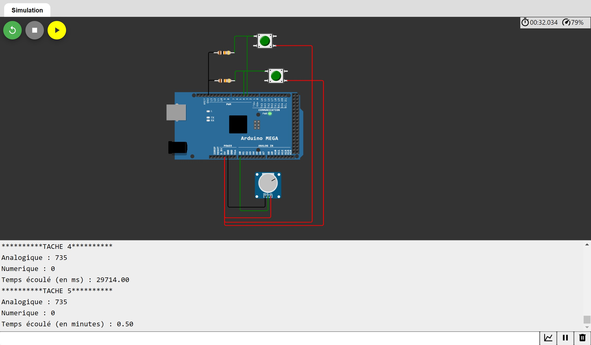

# Projet RTOS - Raphaël GANDUS - ING2 Instrumen,tation - 2022

## Voici le montage utilisé, simulé sur wokwi.com :

Le potentiomètre est branché au port A0, le bouton 1 est branché au port 3 et le bouton 2 au port 4.

## Voici un exemple d'éxecution de mon script :

Le port série affiche d'abord les résultats de la tâche 4 :
  - La valeur Analogique correspond à la valeur envoyée par le potentiomètre, ici 735
  - La valeur Numerique correspond à la résultante de l'addition des deux valeurs des deux      entrées numérique 3 et 4 qui sont branchées avec des boutons poussoirs en montage pull down, ici 0 car aucun bouton n'est pressé. Si in seul bouton était pressé, le résultat serait 1, si les deux boutons étaient préessés, le résultat serait 2
  - La valeur Temps écoulé renvoie le résultat de la fonction millis(), ici 29714 ms, ce qui est cohérent avec le chronomètre en haut à droite qui affiche 32s. Le décalage est dû au délai d'affichage

Une fois la tâche 4 complétée, le sémaphore est libéré ce qui permet à la tâche 5 de récupérer la structure et de l'afficher en apportant une modification :
  - Le temps est désormais affiché en minutes, ici 0,5 minute ce qui correspond bien à 30 secondes

