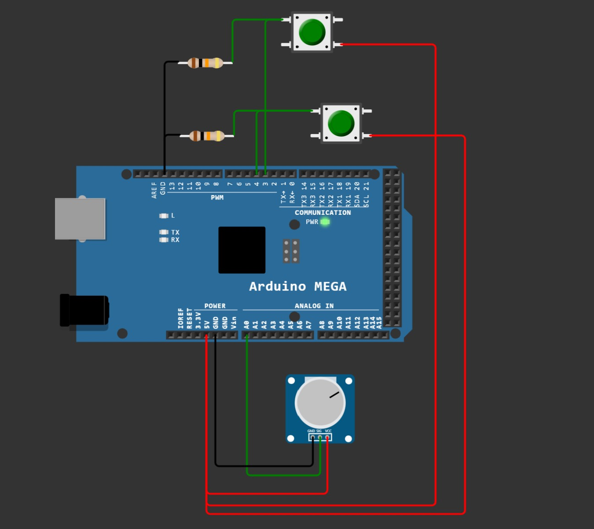

# Projet RTOS - Raphaël GANDUS - ING2 Instrumen,tation - 2022

Voici le montage utilisé, simulé sur wokwi.com :

Le potentiomètre est branché au port A0, le bouton 1 est branché au port 3 et le bouton 2 au port 4.

